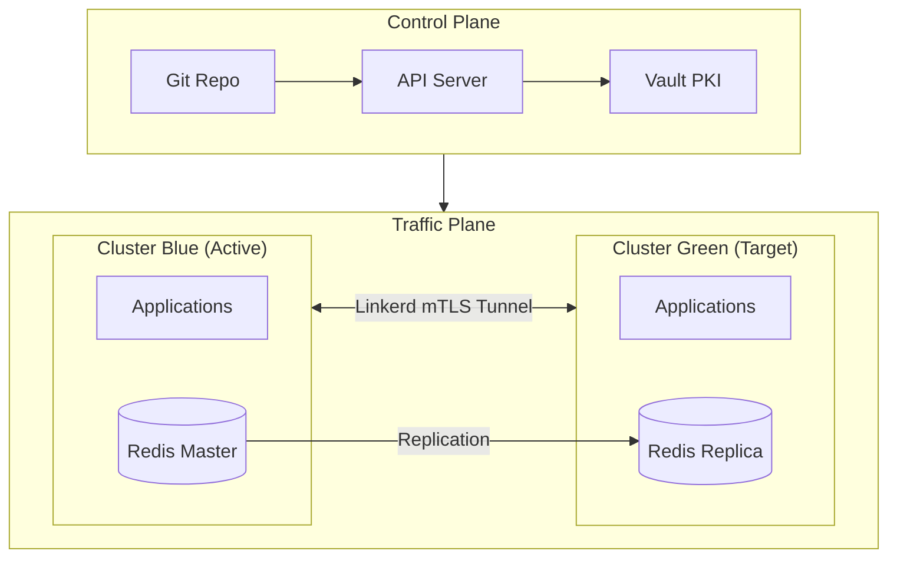
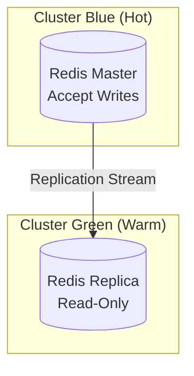
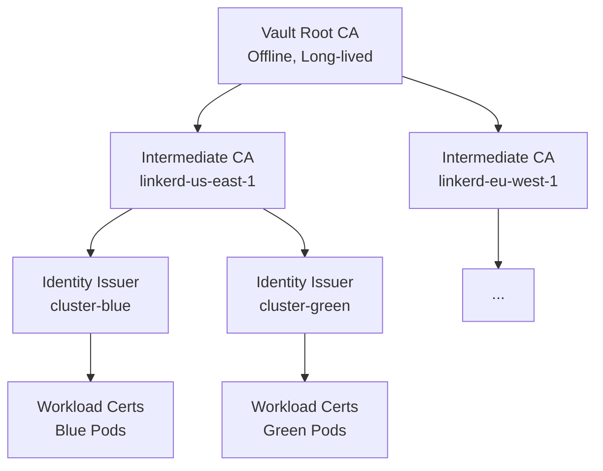
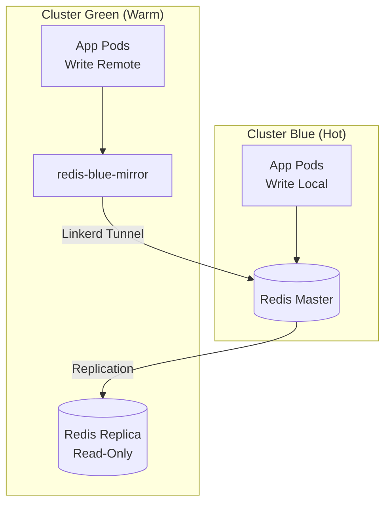
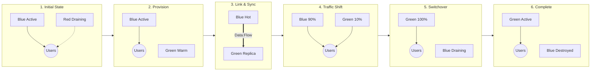
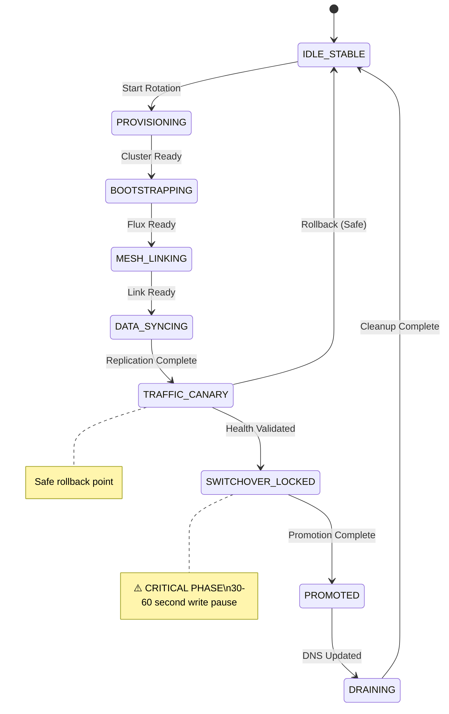
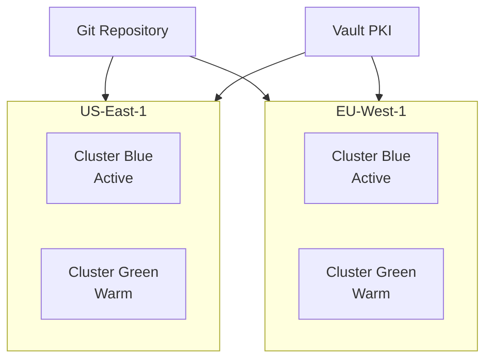

# Bennu: Immutable Kubernetes Cluster Infrastructure

> **Treat clusters as cattle, not pets.**

Bennu is an **Immutable Infrastructure** architecture for Kubernetes that treats entire clusters as ephemeral, replaceable resources. Rather than upgrading clusters in place, Bennu rotates between clusters (Red → Blue → Green) using GitOps orchestration, service mesh traffic splitting, and stateful data replication—achieving zero-downtime cluster migrations.

---

## Table of Contents

1. [The Problem](#the-problem)
2. [Our Solution](#our-solution)
3. [Core Philosophy](#core-philosophy)
4. [Architecture Overview](#architecture-overview)
5. [The Three Planes](#the-three-planes)
6. [Core Components](#core-components)
7. [The Floating Write Pointer](#the-floating-write-pointer)
8. [Red-Blue-Green Rotation Model](#red-blue-green-rotation-model)
9. [State Machine](#state-machine)
10. [Operational Workflow](#operational-workflow)
11. [Safety Mechanisms](#safety-mechanisms)
12. [Rollback Procedures](#rollback-procedures)
13. [Monitoring & Observability](#monitoring--observability)
14. [Deployment Patterns](#deployment-patterns)
15. [Technical Requirements](#technical-requirements)
16. [Roadmap](#roadmap)
17. [Success Criteria](#success-criteria)
18. [Risk Assessment](#risk-assessment)
19. [Alternatives Considered](#alternatives-considered)

---

## The Problem

### Current Challenges with In-Place Cluster Management

Modern Kubernetes operations face several critical challenges:

**Configuration Drift**: Clusters accumulate state changes over time through manual interventions, breaking the principle of infrastructure-as-code. What was deployed often diverges from what's in source control.

**Risky Upgrades**: In-place cluster upgrades (Kubernetes versions, node OS, networking changes) carry significant risk. A failed upgrade can result in extended downtime or data loss.

**Difficult Rollbacks**: When upgrades fail, rolling back to a previous cluster state is complex and error-prone. Many changes are one-way operations.

**Stateful Workload Challenges**: While stateless applications can be easily migrated between clusters, stateful workloads (databases, caches, queues) create coupling to specific clusters, making rotation difficult.

**Testing Production**: It's nearly impossible to fully test infrastructure changes in a staging environment that exactly mirrors production's accumulated state.

### The Core Question

**How do we achieve the benefits of immutable infrastructure at the cluster level while maintaining data consistency and zero downtime?**

---

## Our Solution

### Immutable Cluster Rotation

Bennu treats entire Kubernetes clusters as ephemeral resources in a continuous rotation pattern:

1. **Provision** a new cluster with the desired configuration
2. **Sync** stateful data from the active cluster to the new cluster
3. **Shift** traffic progressively from old to new
4. **Promote** the new cluster to accept writes
5. **Decommission** the old cluster

This rotation happens on a **Red → Blue → Green** cycle, where three cluster identifiers exist but only two clusters are active at any given time.

### Key Innovation: The Floating Write Pointer

The critical breakthrough is separating **compute traffic** (which can be split freely) from **data writes** (which must be strictly controlled). We achieve this through:

- **Dynamic configuration** that tells applications where to send writes
- **Service mesh mirroring** that creates transparent proxies to remote clusters
- **Atomic promotion** of write authority during a brief maintenance window

### Benefits

| Benefit | Description |
|---------|-------------|
| **Zero Configuration Drift** | Every cluster starts from a known Git state |
| **Safe Upgrades** | Test the full cluster configuration before promoting |
| **Easy Rollbacks** | Simply shift traffic back to the previous cluster |
| **Predictable Operations** | Every rotation follows the same tested procedure |
| **Disaster Recovery** | The process doubles as a DR runbook |

---

## Core Philosophy

- **Clusters are Ephemeral**: Clusters are provisioned, used, and destroyed in a continuous rotation
- **GitOps First**: All configuration lives in Git as the single source of truth
- **Zero Downtime**: Traffic and state migration happen progressively with no service interruption
- **Hot-Warm Architecture**: One cluster is always the write master (Hot), new clusters sync data (Warm) before promotion
- **Single Master Rule**: Only one cluster can accept writes at any given time

---

## Architecture Overview



---

## The Three Planes

### 1. Control Plane (The Brain)

| Component | Purpose |
|-----------|---------|
| **Git Repository** | Single Source of Truth with immutable catalogs and mutable cluster state |
| **API Server** | Custom state machine that orchestrates rotations via Git commits |
| **Vault PKI** | Central certificate authority for cross-cluster trust |

### 2. Traffic Plane (The Network)

| Component | Purpose |
|-----------|---------|
| **Ingress (APISIX)** | Receives all user traffic on the active cluster |
| **Service Mesh (Linkerd)** | Connects clusters and enables traffic splitting via mTLS |
| **Traffic Split** | HTTPRoute resources control percentage distribution |

### 3. Data Plane (The State)

| Component | Purpose |
|-----------|---------|
| **Hot-Warm Redis** | Write master on active cluster, read replicas on new clusters |
| **Floating Write Pointer** | Dynamic configuration directs writes to the current master |

---

## Core Components

### Git Repository Structure

The Git repository separates immutable software definitions from mutable deployment state:

```
/
├── catalogs/                      # (Read-Only for API) Application definitions
│   ├── infrastructure/            # Base infrastructure components
│   │   ├── linkerd/              # Linkerd control plane manifests
│   │   ├── apisix/               # APISIX ingress configuration
│   │   ├── vault-agent/          # Vault integration
│   │   └── cert-manager/         # Certificate management
│   │
│   ├── apps/                     # Application manifests
│   │   ├── payment-service/
│   │   │   ├── base/             # Helm charts / Base manifests
│   │   │   └── variants/         # hot-writer / warm-reader configs
│   │   └── redis/
│   │
│   └── profiles/                 # Groupings of applications
│       └── backend-profile.yaml
│
└── clusters/                     # (Read-Write for API) Active deployment state
    └── prod/
        └── us-east-1/
            ├── cluster-blue/     # The "Hot" Cluster
            │   ├── cluster-config.yaml
            │   ├── traffic-state.yaml       # Write pointer configuration
            │   ├── ingress-routing.yaml     # Traffic split weights
            │   ├── profile-sync.yaml
            │   └── links/                   # Linkerd connections
            │
            └── cluster-green/    # The "Warm" Cluster
                └── ...
```

### Key Configuration Files

#### traffic-state.yaml (The Control File)

Controls where applications send writes:

```yaml
# Warm Cluster Configuration
apiVersion: v1
kind: ConfigMap
metadata:
  name: global-traffic-state
data:
  REDIS_READ_HOST: "redis-local.database.svc.cluster.local"
  REDIS_WRITE_HOST: "redis-blue-mirror.database.svc.cluster.local"  # Remote!
  IS_WRITE_MASTER: "false"
  MAINTENANCE_MODE: "false"
```

```yaml
# Hot Cluster Configuration
apiVersion: v1
kind: ConfigMap
metadata:
  name: global-traffic-state
data:
  REDIS_READ_HOST: "redis-local.database.svc.cluster.local"
  REDIS_WRITE_HOST: "redis-local.database.svc.cluster.local"
  IS_WRITE_MASTER: "true"
  MAINTENANCE_MODE: "false"
```

#### ingress-routing.yaml (Traffic Split)

```yaml
apiVersion: gateway.networking.k8s.io/v1beta1
kind: HTTPRoute
metadata:
  name: payment-split
spec:
  rules:
    - backendRefs:
        - name: payment-service           # Local
          weight: 90
        - name: payment-service-green-mirror  # Remote
          weight: 10
```

### API Server

The orchestration brain that manages rotations by manipulating Git:

**Responsibilities**:
- Generate cluster configurations in Git
- Wait for and verify state conditions
- Orchestrate traffic splits
- Manage the "write pointer" atomically
- Enforce safety invariants
- Provide rollback capabilities

**Core Functions**:

```python
def wait_for_linkerd_link(cluster_client, link_name):
    """Blocks until Linkerd Link is healthy and mirror services exist."""
    
def verify_redis_sync(cluster_client, redis_pod):
    """Blocks until Redis replication lag is acceptable."""
    
def update_traffic_weights(cluster_id, local_weight, target_weight):
    """Updates HTTPRoute weights in Git and monitors success rate."""
```

**API Endpoints**:

```
POST   /rotation/start             # Initiate cluster rotation
GET    /rotation/{id}/status       # Get current state
POST   /rotation/{id}/promote      # Promote warm cluster to hot
POST   /rotation/{id}/rollback     # Abort rotation
DELETE /rotation/{id}              # Clean up old cluster

GET    /clusters                   # List all clusters
GET    /clusters/{id}              # Get cluster details
GET    /clusters/{id}/health       # Health check
```

### Linkerd Service Mesh

Linkerd provides the networking layer for cross-cluster communication via Service Mirroring:

1. **Link Creation**: API Server creates a Link CRD on Green pointing to Blue
2. **Service Discovery**: Linkerd on Green discovers services on Blue
3. **Mirror Services**: Linkerd creates `redis-blue-mirror` service on Green
4. **Transparent Proxy**: Apps on Green can write to `redis-blue-mirror` as if local

**Link CRD Example**:

```yaml
apiVersion: multicluster.linkerd.io/v1alpha1
kind: Link
metadata:
  name: cluster-blue
  namespace: linkerd-multicluster
spec:
  targetClusterName: cluster-blue
  gatewayAddress: "k8s-linkerd-gateway-abc12345.elb.us-east-1.amazonaws.com"
  gatewayPort: 4143
  gatewayIdentity: linkerd-gateway.linkerd-multicluster.serviceaccount.identity.linkerd.cluster.local
```

### Redis State Management

Redis implements a Hot-Warm replication model:



### Vault PKI

Vault provides centralized certificate management enabling immediate cross-cluster trust:



### Flux GitOps

Flux continuously reconciles desired state from Git to clusters using the ResourceSet pattern:

```yaml
apiVersion: fluxcd.controlplane.io/v1
kind: ResourceSet
metadata:
  name: backend-profile
spec:
  resources:
    - name: redis
      path: ./catalogs/apps/redis/base
    - name: payment-service
      path: ./catalogs/apps/payment-service/base
```

---

## The Floating Write Pointer

This is the key mechanism ensuring data consistency during rotation.

### Phases of Write Authority

| Phase | Traffic Split | Active Cluster Writes To | New Cluster Writes To |
|-------|--------------|--------------------------|----------------------|
| **Warm Up** | 100% Old | Local (Master) | Old via Mirror (Remote) |
| **Canary 10%** | 90/10 | Local (Master) | Old via Mirror (Remote) |
| **Canary 50%** | 50/50 | Local (Master) | Old via Mirror (Remote) |
| **Switchover** | Paused | **Blocked** | **Blocked** (Promotion) |
| **Promoted** | 100% New | Draining | Local (Master) |

### Write Flow During Warm-Up



---

## Red-Blue-Green Rotation Model

At any point in time, we maintain three cluster identifiers in rotation:

- **Blue**: Current active (handling traffic and writes)
- **Green**: Next generation (warming up, syncing data)
- **Red**: Previous generation (being deprovisioned)

### Rotation Cycle



After rotation: Green → Blue, Blue → Red, and a new Green is created.

---

## State Machine

The system operates as a Finite State Machine (FSM) for each rotation event.

### States

| ID | State | Description |
|----|-------|-------------|
| **S0** | `IDLE_STABLE` | Two clusters active, traffic balanced, no migration |
| **S1** | `PROVISIONING` | Target infrastructure spinning up |
| **S2** | `BOOTSTRAPPING` | Flux installing base controllers |
| **S3** | `MESH_LINKING` | Trust anchors exchanged, Link CRD applied |
| **S4** | `DATA_SYNCING` | Redis replication running, target is warm |
| **S5** | `TRAFFIC_CANARY` | Read-only traffic partially routed to target |
| **S6** | `SWITCHOVER_LOCKED` | **CRITICAL**: Writes paused, data promotion occurring |
| **S7** | `PROMOTED` | Target is master, write pointer updated |
| **S8** | `DRAINING` | Source unlinked and marked for deletion |

### State Diagram



---

## Operational Workflow

### Complete Rotation Timeline (~2-3 hours)

| Time | Phase | Duration | Critical? |
|------|-------|----------|-----------|
| T+0 | Provision Green | 10-15 min | No |
| T+15 | Bootstrap & Trust | 5-10 min | No |
| T+25 | Mesh Linking | 2-5 min | No |
| T+30 | Data Synchronization | 5-30 min | No |
| T+60 | Traffic Canary (10%) | 10-30 min | No |
| T+90 | Traffic Increase (50%) | 10-30 min | No |
| T+120 | Switchover | 30-60 sec | **YES ⚠️** |
| T+122 | DNS Migration | 5-10 min | No |
| T+132 | Cleanup Blue | 5 min | No |
| **Total** | | **~2-3 hours** | |

```mermaid
gantt
    title Cluster Rotation Timeline
    dateFormat HH:mm
    axisFormat %H:%M
    
    section Infrastructure
    Provision Green          :p1, 00:00, 15m
    Bootstrap Controllers    :p2, after p1, 10m
    
    section Networking
    Mesh Linking            :n1, after p2, 5m
    
    section Data
    Redis Replication       :d1, after n1, 30m
    
    section Traffic
    Canary 10%              :t1, after d1, 15m
    Canary 50%              :t2, after t1, 15m
    Canary 90%              :t3, after t2, 15m
    
    section Critical
    Switchover              :crit, c1, after t3, 2m
    
    section Cleanup
    DNS Migration           :f1, after c1, 10m
    Decommission            :f2, after f1, 5m
```



### Phase Details

#### Phase 1: Provisioning (0-15 minutes)

**Actions**:
- API Server generates cluster configuration
- Creates Git directory structure
- Commits initial state to Git
- Triggers infrastructure provisioning (Terraform/Crossplane)

**Exit Criteria**: Kubernetes API reachable, nodes ready

#### Phase 2: Bootstrapping (15-25 minutes)

**Actions**:
- Flux bootstrap installs on new cluster
- Cert-Manager requests certificates from Vault
- Linkerd control plane installs
- Application profile applies

**Exit Criteria**: Flux reconciliation complete, Linkerd healthy

#### Phase 3: Mesh Linking (25-30 minutes)

**Actions**:
- API retrieves credentials from source cluster
- Generates Link CRD and Secret
- Commits to target's Git directory
- Linkerd creates mirror services automatically

**Exit Criteria**: Link status Ready, mirror services exist

#### Phase 4: Data Synchronization (30-60 minutes)

**Actions**:
- Generate `redis-init-sync` Job
- Configure Redis: `REPLICAOF redis-source-mirror 6379`
- Monitor replication lag
- Wait until lag < 1KB for 60 seconds

**Exit Criteria**: Replication complete, lag acceptable

#### Phase 5: Traffic Canary (60-120 minutes)

**Actions**:
- Update HTTPRoute: 10% to target
- Monitor success rate for 10 minutes
- Progressively increase: 20%, 50%, 90%

**Exit Criteria**: Success rate > 99.9% at each weight

#### Phase 6: Switchover (120-122 minutes) ⚠️ CRITICAL

**This is the only phase with write downtime (30-60 seconds)**

**Steps**:
1. **T+0s**: Set `MAINTENANCE_MODE: true` on both clusters
2. **T+30s**: Execute `REPLICAOF NO ONE` on target Redis
3. **T+45s**: Update target's `traffic-state.yaml` to write locally
4. **T+60s**: Flux reconciles, pods reload configuration
5. **T+90s**: Verify writes flowing to target

**Exit Criteria**: Target Redis is master, apps writing successfully

#### Phase 7: DNS Migration (122-137 minutes)

**Actions**:
- Update DNS to point to target's LoadBalancer
- Wait for TTL (300 seconds)
- Verify DNS propagation

**Exit Criteria**: DNS points to target, TTL expired

#### Phase 8: Cleanup (137-142 minutes)

**Actions**:
- Delete Link CRD
- Remove source's Git directory
- Trigger infrastructure destruction

**Exit Criteria**: Source cluster deleted, resources freed

---

## Safety Mechanisms

### Safety Invariants

These rules are enforced by the API Server:

| Rule | Description | Enforcement |
|------|-------------|-------------|
| **Single Master** | Only ONE cluster can have `IS_WRITE_MASTER: true` | Exception on violation |
| **Blind Mirror** | Never write to a mirror before verifying Link is Ready | Pre-condition check |
| **Lag Threshold** | Block switchover if replication lag > 1KB | Gate condition |
| **Split Brain Protection** | Auto-rollback if Linkerd tunnel fails during canary | Continuous monitoring |

### Invariant Enforcement

```python
def enforce_single_master(cluster_group):
    """Only ONE cluster can be write master at any time."""
    masters = [c for c in cluster_group 
               if get_traffic_state(c).get('IS_WRITE_MASTER') == 'true']
    if len(masters) > 1:
        raise SplitBrainError(f"Multiple masters detected: {masters}")

def validate_switchover_preconditions(source, target):
    """Check all preconditions before allowing switchover."""
    lag = get_replication_lag(target)
    if lag > MAX_LAG_BYTES:
        raise ReplicationLagError(f"Lag {lag} exceeds threshold")
    return True
```

---

## Rollback Procedures

### Before Switchover (Safe & Easy)

```bash
# Revert traffic to 100% source
curl -X POST https://api-server.internal/rotation/{id}/rollback

# API will:
# 1. Set traffic split to 100% source
# 2. Delete Link CRD
# 3. Destroy target cluster
```

### After Switchover (Emergency)

**More complex, potential data reconciliation required:**

1. **Re-promote Source to Master**:
   ```bash
   kubectl exec redis-0 -- redis-cli REPLICAOF NO ONE
   ```

2. **Revert Write Pointer** (in Git):
   ```yaml
   REDIS_WRITE_HOST: redis-local
   IS_WRITE_MASTER: "true"
   MAINTENANCE_MODE: "false"
   ```

3. **Shift Traffic Back** via DNS and HTTPRoute updates

4. **Handle Data Divergence**: Writes to target after switchover may be lost

---

## Monitoring & Observability

### Key Metrics

| Metric | Source | Threshold |
|--------|--------|-----------|
| Request Success Rate | Linkerd | > 99.9% |
| Request Latency (p99) | Linkerd | < 200ms |
| Redis Replication Lag | Redis INFO | < 1KB |
| Link Status | Linkerd CRD | Ready=True |
| Pod Restarts | Kubernetes | < 3 in 5min |

### Critical Alerts

| Alert | Condition | Severity |
|-------|-----------|----------|
| Rotation Stuck | In same state > timeout | Critical |
| Split Brain Detected | Multiple masters | Critical |
| Switchover Timeout | > 120 seconds | Critical |
| Link Failure | Link down during canary | Critical |
| Replication Lag High | > 50% of threshold | Warning |

### Prometheus Metrics

```python
from prometheus_client import Counter, Gauge, Histogram

state_transitions = Counter(
    'rotation_state_transitions_total',
    'Total state transitions',
    ['from_state', 'to_state', 'cluster_group']
)

current_state = Gauge(
    'rotation_current_state',
    'Current rotation state',
    ['cluster_group']
)

rotation_duration = Histogram(
    'rotation_duration_seconds',
    'Time to complete rotation',
    ['cluster_group', 'result']
)
```

---

## Deployment Patterns

### Geographic Distribution

The architecture supports multi-region deployments with independent operations:

| Region | Clusters | Git Path |
|--------|----------|----------|
| us-east-1 | Blue (Active), Green (Warm) | `/clusters/prod/us-east-1/...` |
| eu-west-1 | Blue (Active), Green (Warm) | `/clusters/prod/eu-west-1/...` |



### Environment Segregation

All environments share the same application definitions in `/catalogs`:

| Environment | Git Path |
|-------------|----------|
| Production | `/clusters/prod/...` |
| Staging | `/clusters/staging/...` |
| Development | `/clusters/dev/...` |

---

## Technical Requirements

### Performance Requirements

| Metric | Target |
|--------|--------|
| Traffic split update latency | < 30 seconds |
| Flux reconciliation | < 60 seconds |
| State transition decision | < 5 seconds |
| Health check | < 1 second |

### Reliability Targets

| Metric | Target |
|--------|--------|
| API Server uptime | 99.9% |
| Successful rotations | 99.5% |
| Mean time to rotate | < 3 hours |
| Switchover downtime | < 60 seconds |

### Security Requirements

- **Credentials**: Never write plain credentials to Git (use SealedSecrets or Vault)
- **RBAC**: Minimal permissions for Link CRD ServiceAccounts
- **Git Protection**: Branch protection, signed commits, PR reviews
- **mTLS**: All cross-cluster traffic encrypted via Linkerd

---

## Roadmap

### Phase 1: Foundation
- [ ] Git repository structure design
- [ ] Vault PKI infrastructure
- [ ] Initial cluster pair provisioning

### Phase 2: Service Mesh Integration
- [ ] Linkerd deployment with Vault certificates
- [ ] Traffic splitting (HTTPRoute)
- [ ] APISIX ingress configuration

### Phase 3: State Management
- [ ] Redis replication setup
- [ ] Write pointer mechanism
- [ ] Application integration patterns

### Phase 4: API Server Development
- [ ] State machine implementation
- [ ] Safety invariant enforcement
- [ ] API endpoints and observability

### Phase 5: Automation & Testing
- [ ] Test environments
- [ ] Unit, integration, and chaos tests
- [ ] CLI and dashboard tooling

### Phase 6: Production Rollout
- [ ] Staging validation (3+ rotations)
- [ ] Single region production deployment
- [ ] Multi-region expansion

### Phase 7: Operationalization
- [ ] SLO establishment
- [ ] Runbook creation
- [ ] Regular rotation scheduling

---

## Success Criteria

### Technical Metrics

| Metric | Target |
|--------|--------|
| Rotation Success Rate | > 99.5% |
| Switchover Downtime | < 60 seconds |
| Mean Time to Rotate | < 3 hours |
| Data Loss Events | 0 |
| Rollback Success Rate | > 99% |

### Operational Metrics

| Metric | Target |
|--------|--------|
| Configuration Drift Incidents | 0 |
| Failed Upgrade Rollbacks | 0 |
| MTTR for Cluster Issues | < 1 hour |

### Business Metrics

| Metric | Target |
|--------|--------|
| Kubernetes Upgrade Cycle | Monthly |
| Production Incidents from Upgrades | -90% |
| Infrastructure Cost Increase | 15-20% (acceptable for reliability) |

---

## Risk Assessment

### High-Impact Risks

| Risk | Mitigation |
|------|------------|
| **Split Brain** (two masters) | Single master invariant, automated detection, immediate alerts |
| **Extended Switchover** (>5min) | Timeout mechanisms, auto-rollback, manual override |
| **Data Loss** | Replication lag monitoring, switchover gate, backup procedures |
| **API Server Crash** | Idempotent operations, state persistence, resume capability |

### Medium-Impact Risks

| Risk | Mitigation |
|------|------------|
| **Cost Overrun** | Minimize rotation time, schedule off-peak |
| **Complexity** | Documentation, training, gradual rollout |
| **Linkerd Tunnel Instability** | Auto-rollback, redundant gateways |
| **Git Repository Downtime** | Local cache, read-only continues, alerts |

---

## Alternatives Considered

### In-Place Upgrades with Blue-Green Node Pools

**Rejected**: Doesn't achieve immutability at cluster level; control plane still upgraded in-place.

### Hot-Hot Multi-Master

**Rejected**: Complex distributed consensus, conflict resolution, higher split-brain risk. Hot-Warm provides sufficient availability with dramatically lower complexity.

### Pure GitOps Without API Server

**Rejected**: Can't wait for conditions (replication lag, success rate), no rollback logic, safety checks require complex CRDs.

---

## Conclusion

Bennu represents a paradigm shift in Kubernetes infrastructure management—treating entire clusters as immutable, ephemeral resources while maintaining data consistency and zero downtime.

### What Makes This Possible

1. **GitOps as the contract**: Single source of truth enables reproducibility
2. **Service mesh as the bridge**: Linkerd makes cross-cluster communication transparent
3. **The floating write pointer**: Separating traffic from data writes enables progressive migration
4. **The API server**: Intelligent orchestration enforces safety and handles complexity

### Key Guarantees

- ✅ **Elimination of configuration drift** through immutable infrastructure
- ✅ **Safe, tested upgrades** by validating the full stack before promotion
- ✅ **Easy rollbacks** by shifting traffic to the previous cluster
- ✅ **Predictable operations** through a well-defined state machine
- ✅ **Zero-downtime migrations** with only 30-60 seconds of write pause

---

**Document Version**: 1.0  
**Status**: Proposal
